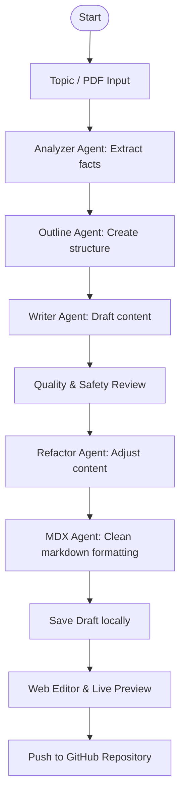

# 📝 AI Blog Platform (Blog Automation)

An intelligent, multi-agent AI system that automates the research, writing, formatting, and publishing of high-quality blog posts. Powered by **FastAPI** + **LangGraph** on the backend, and **Next.js** on the frontend.

---

## 🚀 Key Features

* **Multi-Agent Workflow**: Utilizes LangGraph to coordinate several specialized AI agents (source analyzer, outline developer, blog writer, quality reviewer, safety check, and MDX formatter).
* **PDF & Topic Input**: Start from a simple topic prompt or upload a source PDF document (up to 25MB) to extract context and write deep, factual articles.
* **Side-by-Side Editor**: Edit the generated blog posts in a real-time markdown/MDX editor with live visual previews.
* **Direct GitHub Publishing**: Save draft files locally or publish the final version directly to your target GitHub repository with a single click.

---

## 🛠️ System Architecture

The workflow is driven by a stateful graph where agents collaboratively refine the blog content:



---

## 📂 Project Structure

```text
├── backend/
│   ├── agents/         # LangGraph AI agents (writer, reviewer, pdf extractor, etc.)
│   ├── api/            # FastAPI API endpoints (routes.py)
│   ├── core/           # Configuration & LLM clients (config.py, llm.py)
│   ├── graph/          # LangGraph state and workflow logic (state.py, workflow.py)
│   └── main.py         # Backend API entrypoint
├── blogs/              # Locally saved draft files
├── frontend/           # Next.js web application
│   ├── app/            # Next.js App router (pages, layout, globals.css)
│   └── public/         # Static assets
├── uploads/            # Temporary directory for uploaded source PDFs
├── .env                # Local secrets (ignored by Git)
├── requirements.txt    # Python dependencies
└── runtime.txt         # Production Python version definition
```

---

## ⚙️ Local Installation & Setup

### Prerequisites
* Python 3.10.x
* Node.js v18+ & npm

### 1. Clone & Configure Secrets
Create a `.env` file in the root folder:
```env
GROQ_API_KEY=your_groq_api_key
GITHUB_TOKEN=your_github_personal_access_token
GITHUB_REPO=username/repository-name
```
* *Note: The GITHUB_TOKEN needs `repo` write scopes.*

### 2. Set Up the Backend
1. Open your terminal in the root directory.
2. Create and activate a Python virtual environment:
   ```bash
   python -m venv venv
   # On Windows (PowerShell):
   .\venv\Scripts\Activate.ps1
   # On macOS/Linux:
   source venv/bin/activate
   ```
3. Install dependencies:
   ```bash
   pip install -r requirements.txt
   ```
4. Start the FastAPI server:
   ```bash
   python -m backend.main
   ```
   *The backend will run on [http://localhost:8000](http://localhost:8000).*

### 3. Set Up the Frontend
1. Open a new terminal in the `frontend` directory:
   ```bash
   cd frontend
   ```
2. Install npm packages:
   ```bash
   npm install
   ```
3. Start the Next.js development server:
   ```bash
   npm run dev
   ```
   *The frontend will run on [http://localhost:3000](http://localhost:3000).*

---

## ☁️ Deployment

### Backend (Render / Koyeb)
Deploy as a **Web Service** with the following options:
* **Build Command**: `pip install -r requirements.txt`
* **Start Command**: `uvicorn backend.main:app --host 0.0.0.0 --port $PORT`
* **Environment Variables**: Add your `GROQ_API_KEY`, `GITHUB_TOKEN`, `GITHUB_REPO`, and `FRONTEND_ORIGINS`.

### Frontend (Vercel)
Deploy as a **Next.js Project** with:
* **Root Directory**: `frontend`
* **Environment Variable**: `NEXT_PUBLIC_API_URL` set to your deployed backend URL.
